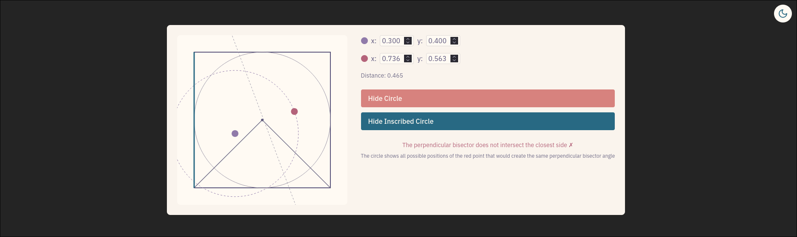
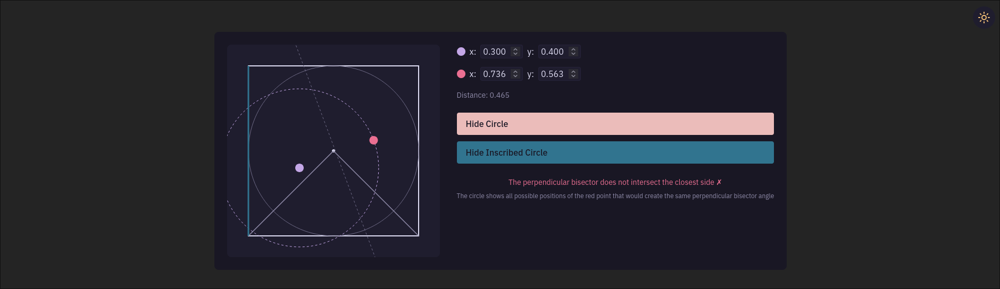

# Beside The Point

AI generated visualization of [Nov 2024 Jane Street Puzzle](https://www.janestreet.com/puzzles/current-puzzle/)

> Puzzle Prompt:

> Two random points, one red and one blue, are chosen uniformly and independently
> from the interior of a square. To ten decimal places, what is the probability that
> there exists a point on the side of the square closest to the blue point
> that is equidistant to both the blue point and the red point?

## Screenshots

